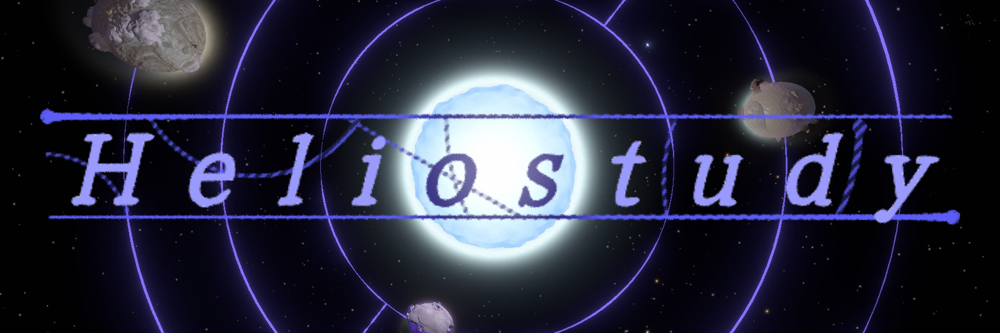
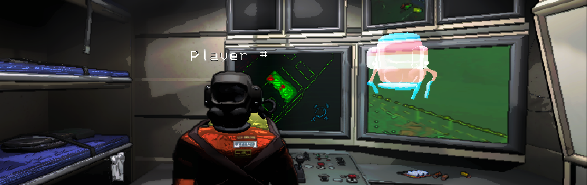
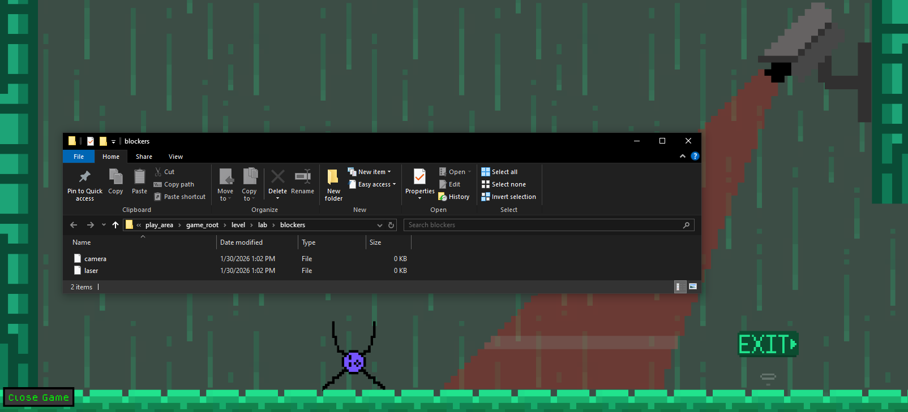

Hello there! I go by coderCleric online, and I am a passionate programmer with a particular interest in game design and development. In the sections down below I’ve put some of the projects that I’m most proud of, I invite you to take a look at them!
## [Forgotten Castaways](https://github.com/coderCleric/DeepBramble)

By far the project that I’m most proud of, Forgotten Castaways is a mod for the game Outer Wilds. The mod aims to add additional story and narrative to the game by allowing the player to explore deeper into one of the game’s more interesting areas. To do this, the mod adds new characters, locations, lore, and puzzles.  

Being such a large undertaking, a number of different tools were used during the creation of this mod. Being a mod for Outer Wilds, there was naturally a heavy use of the Unity game engine as well as the C# programming language. The mod also uses various tools created by the Outer Wilds modding Community, such as the [Outer Wilds Mod Loader](https://github.com/ow-mods/owml) and [New Horizons](https://github.com/Outer-Wilds-New-Horizons/new-horizons). I even ended up making a custom development tool to help place the massive amount of text in the mod, which I later released as the [Nomai Text Printer](https://github.com/coderCleric/NomaiTextPrinter). 

Developed largely as a solo project, external contributions to the mod were limited to music, certain visual assets, brainstorming, and feedback on existing elements. With almost three years between the initial commit and the formal release of the mod, this was a true test of my ability to commit to a long-term project. Overall I am very proud of the end result, and what it demonstrates for my ability as a game developer.

## [Heliostudy](https://github.com/2walker2/OWJam5ModProject)

Heliostudy is another Outer Wilds mod, this one being created in just two weeks for the fifth Outer Wilds mod jam. This mod was intended to provide a smaller scale, more lighthearted narrative alongside some fun and creative puzzles.  

While most of my other projects have been done without much intervention from others, Heliostudy was actually created by a team consisting of me and three other people. This meant that we all had to work collaboratively and utilize our social skills in order to create a mod that we were proud of. In this team my role was to contribute to the narrative and puzzle concepts, program a portion of the puzzle logic, and write the majority of the character dialogue. Overall Heliostudy turned out to be a very successful mod, winning first place in the jam and still being considered one of the highest quality story mods in the community.

## [Poltergeist](https://github.com/coderCleric/Poltergeist)

Poltergeist is a mod for the game Lethal Company, aiming to provide players who die in-game with a novel gameplay mode. Essentially, dead players are turned into ghosts instead of entering a standard spectate mode in order to maintain their engagement with the game. While ghosts, players are able to fly around in a freecam mode and can perform various interactions. These interactions include opening/closing doors, pestering enemies, and even manifesting for living players to see.  

These actions drain power from the ghosts, a resource that recharges over time and limits their ability to interact with the living world. The maximum amount of power that ghosts have also increases for each player that dies, with the power requirement of some interactions being too high to perform until most players are dead. This organically increases how much living players are haunted as time goes on and more players die.  

Since Lethal Company is a Unity game, this mod uses the Unity game engine alongside the C# programming language. In addition to standard Unity components demonstrated in my other projects, the mod also makes heavy use of custom networking. Specifically, the mod uses Unity’s NetworkObjects alongside remote procedure calls to ensure that all mod behaviors are appropriately synced to all players. The mod is released via the Thunderstore mod page and is intended to be installed using the R2ModManager, although other mod managers and manual installations are possible. The mod also uses a robust config file to make itself heavily customizable, allowing player groups to tailor it to their personal preference.  

Overall, Poltergeist does a very good job of preventing boredom in dead players, providing them with a variety of ways to help and hinder their living friends. With almost 900,000 cumulative downloads, it is quite a popular mod that many players consider to be a must-have.

## [Computer Literacy Game](https://github.com/coderCleric/Computer-Literacy-Game)

The Computer Literacy Game is a small game that I made to be the thesis project for my Master’s degree. As the name may suggest, this game was created to help teach late middle and early high school students about the digital file system, with a focus on how the file system is organized via folders.  

To do this, the game presents players with a number of different puzzles that they must pass before the game can be completed. These puzzles require the player to interface with the actual file system of the machine, and perform some sort of file system operation. As an example, a level may feature an impassable boulder that blocks the path to the next level, with the boulder only disappearing once the player finds and deletes the “boulder.txt” file related to it. The game also features adaptive learning elements, with the difficulty of puzzles being automatically adjusted based on player performance.  

The game itself was created with the Unity game engine and C#, with other elements of the project being made using other technologies. Specifically, a MySQL database was maintained on a Google Compute Engine during testing, with entries being made via a PHP script. Data analysis was then performed using Python, helping to condense and analyze trends in the data. The game proved to show promise, with most students seeming to have a better understanding of how to organize the digital file system after playing the game than they did before.
